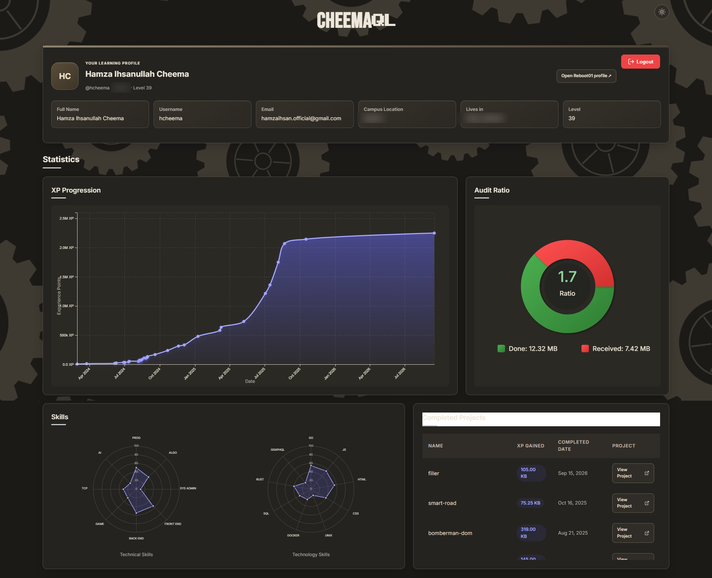

# CheemaQL — Reboot01 Dashboard

A dashboard for Reboot01 students to view learning progress, track peer-audit assignments, and explore campus cohort activity.

**Live Demo:** [View the application](https://cheemaql-dashboard.vercel.app)



## Features

- XP progression, audit ratio, skill charts, and completed projects.
- Pending peer audits with deadlines and repository links.
- Cohort rankings and searchable project activity.
- Light and dark themes with a responsive layout.

## Technologies

HTML, CSS, JavaScript, GraphQL, D3.js, and GSAP.

## Run locally

Requires a Reboot01 account, a modern browser, and Python for the local server. No installation or build step is needed.

Start the server from the repository directory:

```sh
python -m http.server 5501
```

Open [localhost:5501](http://localhost:5501/), enter your Reboot01 username or email and password, check **Trust me**, and click **Login**.
